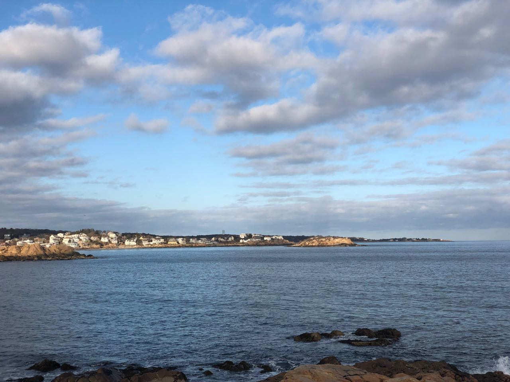

+++
title = "Road Trips Around Cambridage"
+++

## Road Trips Around Cambridge

### Hingham to Hull

Take I-93 and Mass 3A southbound, and make a detour through Quincy Shore Dr to
get a view of the Atlantic Ocean. Then, follow Mass 3A to Hingham. Once in
Hingham, follow Gegorge Washington Blvd and Nantasket Ave all the way towards
Hull. Driving this route in the early evening is also fun. You can watch the
Moon rising from the horizon and glowing in gold.




hull_route_len = hull_route.length;
hull_route_points = [];
for (i = 0; i < hull_route_len; i++) {
    hull_point = new mapkit.Coordinate(hull_route[i]['latitude'], hull_route[i]['longitude'])
    hull_route_points.push(hull_point);
}
hull_overlay_opt = {style: new mapkit.Style({lineWidth: 2})}
hull_overlay = new mapkit.PolylineOverlay(hull_route_points, hull_overlay_opt);
hull_map.addOverlay(hull_overlay);
hull_map.showItems(hull_overlay);


### Essex Costal Scenic Byway

Essex Costal Scenic Byway basically follows Mass 127 and 127A, starting at
Salem and ending in Rockport. To get to the Byway from Cambridage, take US
Route 1 northbound and then I-95 eastbound to Salem, then follow Mass 127.
The Byway passes through Gloucester, where you can detour through Atlantic Rd
to get a close view of the sea. There are many costal parks along the route,
   where you can stop and have some fun.

